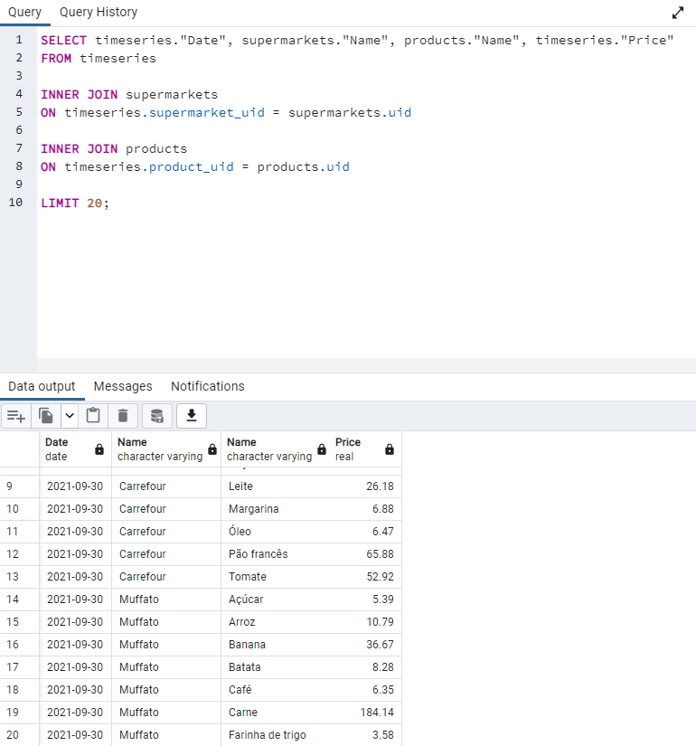

# Database

## Pré-requisitos

- Docker

## Informações

Este repositório contém definições de tabelas para as bases de dados que hospedam as time series de preços captadas pela equipe da UTFPR e pelo [scraper](https://github.com/lukeathedev/scraper).

## TODOs

Definir as tabelas para o scraper

## Estrutura dos Arquivos

xls/ é uma pasta que agrega os templates de planilhas a serem enviadas por e-mail para o departamento do EconoStat, além de helpers para a transformação de dados.

## Estrutura da Base de Dados

### public.supermarkets

| id  | uid        | Name    |
|-----|------------|---------|
| int | varchar(8) | varchar |

### public.products

| id  | uid        | Name    | Quantity |
|-----|------------|---------|----------|
| int | varchar(8) | varchar | varchar  |

### public.timeseries

| id  | Date | supermarket_uid | product_uid   | Price |
|-----|------|-----------------|---------------|-------|
| int | date | varchar(8) FK   | varchar(8) FK | real  |